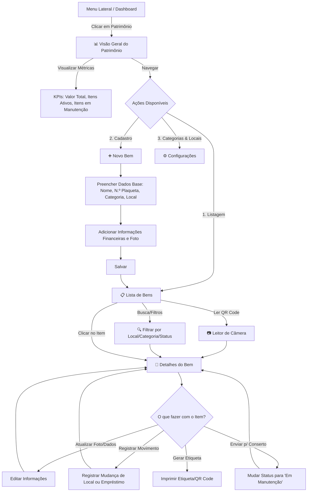

# Planejamento do Módulo de Patrimônio

Este documento contém o PRD (Product Requirements Document), o Schema Prisma e o Flowchart de UX para o novo módulo de Patrimônio.

## 1. PRD (Roteiro) - Módulo de Patrimônio

### 1.1 Objetivo do Produto
Criar um sistema de gestão de ativos e inventário (Patrimônio) integrado ao aplicativo atual da igreja, permitindo catalogar, rastrear e gerenciar o ciclo de vida dos bens (móveis, imóveis, eletrônicos, instrumentos, etc.).

### 1.2 Público-Alvo
- **Administradores / Liderança**: Para visão geral e controle financeiro do patrimônio.
- **Tesoureiros**: Para acompanhamento de aquisições e depreciações.
- **Zeladores / Diáconos**: Para controle de localização, empréstimos e manutenção física dos bens.

### 1.3 Casos de Uso (User Stories)
- Como administrador, quero cadastrar um novo bem (com foto, nota fiscal, valor e número de tombamento) para manter o registro atualizado.
- Como zelador, quero registrar a mudança de localização de uma caixa de som (ex: do Templo para o Salão Anexo) para saber onde cada item está.
- Como tesoureiro, quero extrair um relatório do valor total dos bens divididos por categoria.
- Como líder, quero ler um QR Code colado em um equipamento usando o celular para abrir a ficha completa dele no sistema.
- Como administrador, quero dar baixa em um equipamento que quebrou ou foi doado, mantendo seu histórico.

### 1.4 Requisitos Funcionais (Core Features)
- **Gestão de Categorias e Locais**: Capacidade de criar categorias (Eletrônicos, Móveis) e locais (Templo, Sala Kids).
- **Cadastro de Bens (CRUD)**:
  - Campos: Nome, Descrição, Categoria, Localização, Data de Aquisição, Valor de Aquisição, Número de Patrimônio (Tombamento), Estado de Conservação, Status, URL da Foto.
- **Histórico de Movimentações**: Registro de quando um bem muda de lugar, vai para conserto ou é emprestado.
- **Gerador de Etiquetas (QR Code)**: Geração e impressão de QR Codes que linkam direto para os detalhes do bem.
- **Dashboard de Patrimônio**: Resumos de total investido, quantidade de itens por localização e itens necessitando de manutenção.

### 1.5 Requisitos Não-Funcionais
- Interface Mobile-first (importante para quem vai fazer inventário circulando pelo prédio com o celular).
- Integração de imagens rápida com preview.
- Alta performance nas buscas.

---

## 2. Schema Prisma

Abaixo o schema Prisma modelando as tabelas necessárias para o módulo:

```prisma
datasource db {
  provider = "postgresql"
  url      = env("DATABASE_URL")
}

generator client {
  provider = "prisma-client-js"
}

// Categoria para agrupar os bens (ex: Instrumentos, Móveis, Eletrônicos)
model CategoriaPatrimonio {
  id          String       @id @default(uuid())
  id_igreja   String       // Relacionamento com a igreja (Tenant)
  nome        String
  descricao   String?
  patrimonios Patrimonio[]
  
  created_at  DateTime     @default(now())
  updated_at  DateTime     @updatedAt
}

// Localização física dentro ou fora da igreja
model LocalizacaoPatrimonio {
  id          String       @id @default(uuid())
  id_igreja   String
  nome        String       // ex: "Templo Principal", "Depósito 1"
  descricao   String?
  patrimonios Patrimonio[]
  
  created_at  DateTime     @default(now())
  updated_at  DateTime     @updatedAt
}

// Tabela principal de Bens / Patrimônio
model Patrimonio {
  id                 String                  @id @default(uuid())
  id_igreja          String
  nome               String
  descricao          String?
  numero_tombamento  String?                 // Código de patrimônio / Plaqueta
  valor_aquisicao    Decimal?                @db.Decimal(10, 2)
  data_aquisicao     DateTime?
  estado_conservacao EstadoConservacao       @default(BOM)
  status             StatusPatrimonio        @default(ATIVO)
  foto_url           String?
  
  categoria_id       String
  categoria          CategoriaPatrimonio     @relation(fields: [categoria_id], references: [id])
  
  localizacao_id     String?
  localizacao        LocalizacaoPatrimonio?  @relation(fields: [localizacao_id], references: [id])
  
  movimentacoes      MovimentacaoPatrimonio[]
  
  created_at         DateTime                @default(now())
  updated_at         DateTime                @updatedAt
}

// Histórico de alterações, manutenções ou empréstimos
model MovimentacaoPatrimonio {
  id                 String               @id @default(uuid())
  patrimonio_id      String
  patrimonio         Patrimonio           @relation(fields: [patrimonio_id], references: [id])
  tipo_movimentacao  TipoMovimentacao
  data_movimentacao  DateTime             @default(now())
  responsavel        String               // Nome ou ID do membro responsável
  observacao         String?
  
  created_at         DateTime             @default(now())
}

enum EstadoConservacao {
  NOVO
  BOM
  REGULAR
  RUIM
  SUCATA
}

enum StatusPatrimonio {
  ATIVO
  EM_MANUTENCAO
  EMPRESTADO
  BAIXADO
}

enum TipoMovimentacao {
  AQUISICAO
  MANUTENCAO
  EMPRESTIMO
  DEVOLUCAO
  MUDANCA_LOCAL
  BAIXA
}
```

---

## 3. Flowchart (Mermaid) - Jornada UX

Este fluxograma demonstra a experiência do usuário ao navegar pelo Módulo de Patrimônio no aplicativo.


